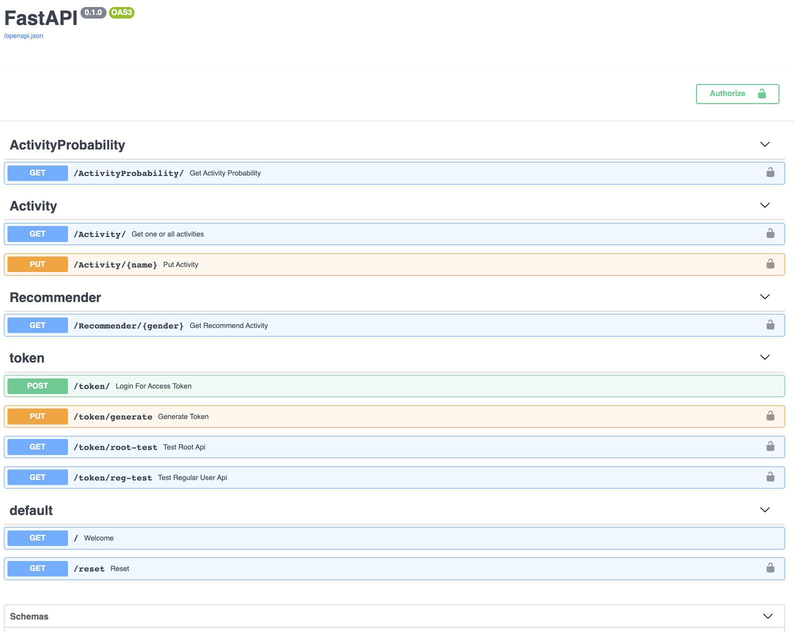
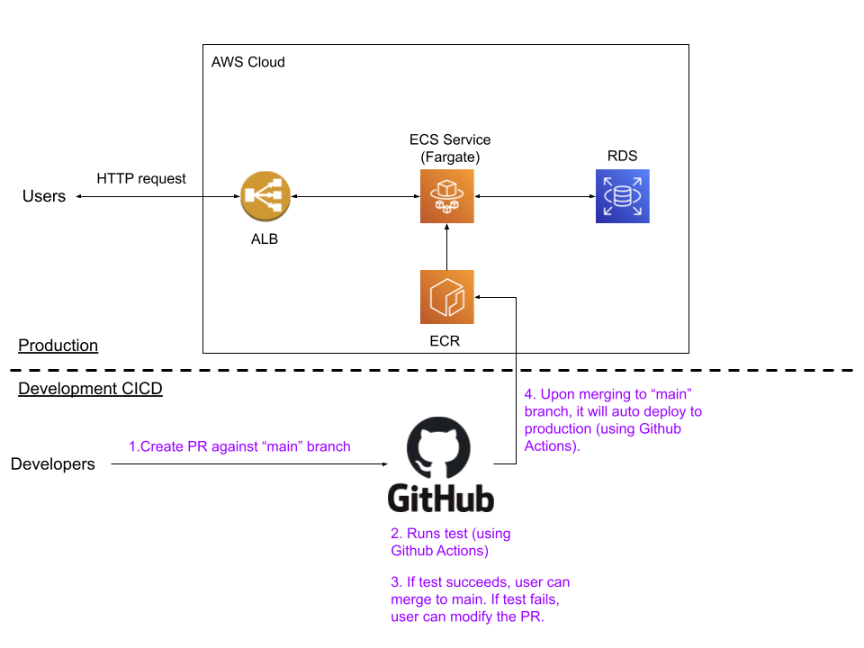

# Activity Recommender: A simple machine learning REST service

## Goal

- What is the goal?

  In this project, I want to practice

  - creating a REST service with open API specification using FastAPI

  - setting up CICD pipeline on Github using Github Actions

  - hosting a machine learning REST service on AWS serverlessly using application load balancer (ALB), Elastic Container Service (ECS) with Fargate, and Relational Database Service (RDS)

- What is NOT the goal?

  - The machine learning algorihtm itself is not the goal. Therefore, I use a very simple machine learning algorithm to practice.

## REST Service Description

### What does the service do?

- User can provide his/her gender, and the service will return a recommended activity, e.g., basketball, for the user. The recommendation wil be based on the conditional probability of each activity for that gender.

- User can update the activity database, that is, the number of male players and female players for each activity.

- User can see all the activities and the recommended probability for both male and female.

- Root user can create new user and generate a user-specific JWT token.

- Root user can reset the activity database.

### API Specification

- [openapi.json](openapi.json)

  - If you prefer GUI, you have two options.
  
    - First, you can copy-paste [openapi.json](openapi.json) to any  online swagger visulation tool (for example, [swagger editor](https://editor.swagger.io/)).

    - Second, you can build the serice locally, and look at the API documentation locally.

        ```bash
        # Assuming you have already clone the project locally

        # Build the service docker image
        make build

        # Run the service using docker
        make run

        # Then, you can go to 
        #             http://localhost/docs 
        # to see the API documentations.
        # Furthermore, you can test the API endpoints directly on it.
        # However, it is for lightweight exploration and should not be used for API testing. 
        # I would recommend using proper http client (e.g., Postman) for API testing.

        # Shutdown the service
        make stop
        ```

        - The API documentation will look like the following.

        

## Architecture

[Architecture](https://docs.google.com/drawings/d/1tRYPP8mSjDhIAwD4rIoPimHcRTKtRZiXXFkkpPy2Nf4/edit?usp=sharing)



- The produciton service is hosted on AWS in a serverless fashion.

  - The Application Load Balancer (ALB) takes user requessts (see [API Specification](#api-documentation)), and forward the request to ECS Fargate services.

  - If the service load is too high, ECS will auto scale up the nubmer of tasks to meet the demand. If the service load is low, ECS will auto scale down the nubmer of tasks.

  - A RDS (running MySQL) is the database.

### CICD using Github Actions

- Running unit test for every PR

  - In [main.yml](.github/workflows/main.yml), we run unit test (in docker) for every PR against the main branch.

  - If the test succeeds, user can merge the PR to the main branch.

- Audo deployment after PR is merged to the main branch

  - In [build_deploy.yml](.github/workflows/build_deploy.yml), we deploy the service to production.

  - The key steps are

    1. Build and test the docker image again to ensure it can work.

    2. Send the newly built image to ECR.

        - For AWS credentials, we use Github secrets.

    3. Redeploy the ECS task and service

        - In [build_deploy.yml](.github/workflows/build_deploy.yml), we set `wait-for-service-stability: true`. This means we will wait untill the service is redeployed and is in a steady state.

## Cost Estimation

- Total monthly cost: $40.25

- RDS

  - Monthly cost: 14.71 USD

  - Details

    - Instance type: db.t2.micro

    - Storage amount: 20 GB

    - Single AZ

    - On Demand

- ECS Service (Fargate)
  
  - Monthly cost: 8.88 USD

  - Details

    - Number of task: 1

    - 0.25 vCPU + 0.5 GB

- Application Load Balancer (ALB)

  - Monthly cost: 16.66 USD

  - Details

    - Number of ALB: 1

    - Fixed hourly charge per ALB: $0.0225 per hour

## Lessons learned & After thoughts

- Feedback on FastAPI

  - Aside from the superior performance (see [benchmarks](https://fastapi.tiangolo.com/benchmarks/) for details), what I like FastAPI the most is its auto-generated specification.

  - All you need to do is to document the code using Python type hinting and some FastAPI-specific documentation. It will auto genrate a Open API specification (see [openapi.json](openapi.json)).

  - Based on [openapi.json](openapi.json), user can know how to use the API. 

- RDS is more expensive than DynamoDB, and is less flexible than DynamoDB.

  - The benefit of using RDS is we can use SQLAlchemy as the interface, and change any relational database. ACtually, during the development, I use SQLite as the relation database.

  - Cost comparison

    - RDS has a constant operaiton cost, even if you are not using the database. Morevoer, if you want to manually stop the database to save money, it can only be stopped for 7 days.

    - However, DynamoDB has a pay-per-user pricing model, that is, if there are no user using your system, you don't need to pay anything. This is a much better pricing model for low usage applications.

  - Flexibility comparison

    - For RDS, if the service load increases, you need to manually scale the RDS by changing the size. This means downtime for the user.

    - For DynamoDB, this is being handled by AWS. Therefore, DynamoDB is more flexible than RDS.

- Userful resources

  - [FastAPI](https://fastapi.tiangolo.com/)

- Fargate error out with "ResourceInitializationError"
  - [Stackoverlow discussion](https://stackoverflow.com/questions/61265108/aws-ecs-fargate-resourceinitializationerror-unable-to-pull-secrets-or-registry)

## Future extensions

1. Use Terraform to set up the infrastructure

    - Currently, I use the AWS UI to create the infrastructure. However, it will be better if we use terraform to set up the infrastructure.